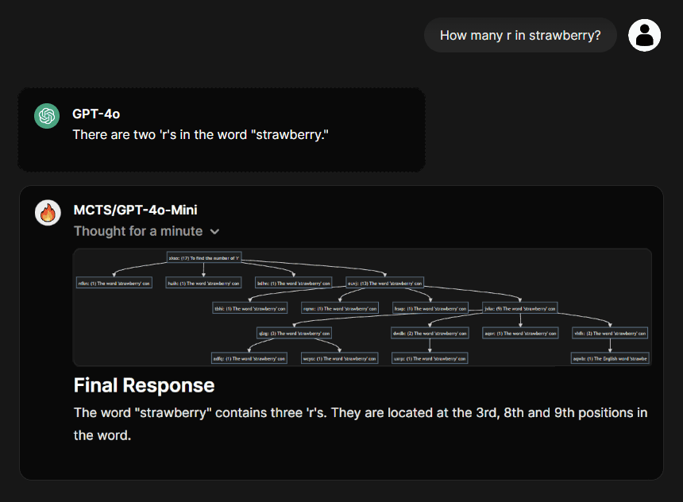

# MCTS OpenAI API Wrapper

[](https://github.com/bearlike/mcts-openai-api/pkgs/container/mcts-openai-api)

<p align="center">
   
</p>

Monte Carlo Tree Search (MCTS) is a heuristic search algorithm that systematically explores a tree of candidate outputs to refine language model responses. Upon receiving an input, the MCTS pipeline generates multiple candidate answers through iterative simulations. In each iteration, the algorithm evaluates and updates these candidates based on feedback, propagating the best scores upward. This process enhances inference by scaling the model's reasoning capabilities, enabling the selection of the optimal response from multiple candidates.

## Overview

This FastAPI server exposes two endpoints:

| Method | Endpoint               | Description                                                                   |
| ------ | ---------------------- | ----------------------------------------------------------------------------- |
| POST   | `/v1/chat/completions` | Accepts chat completion requests. The call is wrapped with an MCTS refinement |
| GET    | `/v1/models`           | Proxies a request to the underlying LLM provider’s models endpoint            |

During a chat completion call, the server runs an MCTS pipeline that produces iterative updates. Each update includes a dynamic Mermaid diagram and detailed logs of the iteration process. All intermediate responses are combined into a single `<details>` block. Finally, the final answer is appended at the end using a consistent, structured markdown template.

## Getting Started

### Deploy using Docker (Recommended) 🐳

1. Create a `secrets.env` with the variables from the `docker-compose.yml` file.
2. Use this command to pull the image and deploy the application with Docker Compose:

    ```bash
    docker pull ghcr.io/bearlike/mcts-openai-api:latest
    docker compose --env-file secrets.env up -d

    # Go to http://hostname:8426/docs for Swagger API docs and test the endpoints.
    ```

3. Use `http://hostname:8426/v1` as the OpenAI Base URL with any API key in any compatible application.

---

<details>
<summary>Expand to view <code>Manual Installation</code></summary>

### Manual Installation

#### Prerequisites

- Python 3.13+
- [Poetry](https://python-poetry.org) for dependency management

#### Setup

1. **Clone the repository:**

   ```bash
   git clone https://github.com/bearlike/mcts-openai-api.git
   cd mcts-openai-api
   ```

2. **Copy the Environment File:**

   Copy the example environment file to `.env` and set your `OPENAI_API_KEY`:

   ```bash
   cp .env.example .env
   ```

   Open the `.env` file and update the `OPENAI_API_KEY` (and other settings if needed).

3. **Install Dependencies:**

   Use Poetry to install the required packages:

   ```bash
   poetry install
   ```

4. **Run the Server:**

   Start the FastAPI server with Uvicorn:

   ```bash
   # Visit http://mcts-server:8000/docs to view the Swagger API documentation
   uvicorn main:app --reload
   ```


</details>

---

## Testing the Server

You can test the server using `curl` or any HTTP client.

### Example Request

```bash
curl -X 'POST' \
  'http://mcts-server:8000/v1/chat/completions' \
  -H 'accept: application/json' \
  -H 'Content-Type: application/json' \
  -d '{
  "model": "gpt-4o-mini",
  "messages": [
    {
      "role": "user",
      "content": "How many R in STRAWBERRY?"
    }
  ],
  "max_tokens": 1024,
  "temperature": 0.5,
  "reasoning_effort": "low"
}' | jq -r '.choices[0].message.content'
```

This request will return a JSON response with the aggregated intermediate responses wrapped inside a single `<details>` block, followed by the final answer.

---

## Endpoints

### POST `/v1/chat/completions`

Wraps a chat completion request in an MCTS pipeline that refines the answer by generating intermediate updates and a final response.

| Parameter        | Data Type          | Default  | Description                                                                                                 |
| ---------------- | ------------------ | -------- | ----------------------------------------------------------------------------------------------------------- |
| model            | string (required)  | N/A      | e.g., `gpt-4o-mini`.                                                                                        |
| messages         | array (required)   | N/A      | Array of chat messages with `role` and `content`.                                                           |
| max_tokens       | number (optional)  | N/A      | Maximum tokens allowed in each step response.                                                               |
| temperature      | number (optional)  | `0.7`    | Controls the randomness of the output.                                                                      |
| stream           | boolean (optional) | `false`  | If false, aggregates streamed responses and returns on completion. If true, streams intermediate responses. |
| reasoning_effort | string (optional)  | `normal` | Controls the `MCTSAgent` search settings:                                                                   |
| =>               | =>                 | =>       | **`low`** - 2 iterations, 2 simulations per iteration, and 2 child nodes per parent (default).           |
| =>               | =>                 | =>       | `medium` - 3 iterations, 3 simulations per iteration, and 3 child nodes per parent.                         |
| =>               | =>                 | =>       | `high` - 4 iterations, 4 simulations per iteration, and 4 child nodes per parent.                           |

### GET `/v1/models`

Proxies requests to list available models from the underlying LLM provider using the `OPENAI_API_BASE_URL`.

---

## License

This project is licensed under the MIT License.
